# Computer Networking Lab 10 -- SSL

## 1

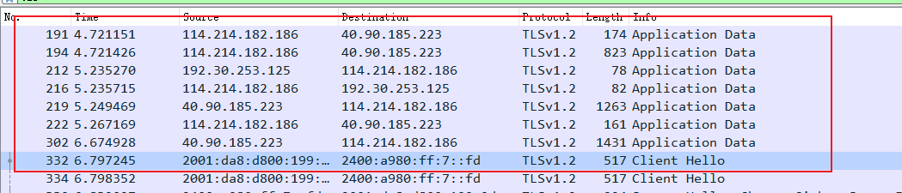
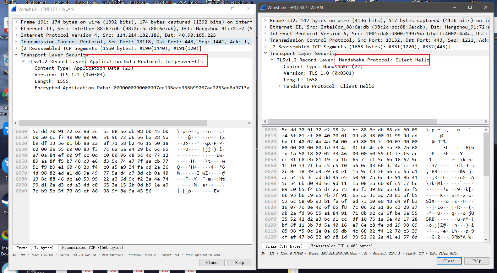

| 序号 |                 来源 IP                 | 来源类型 | SSL 记录数量 |                  包含的 SSL 记录类型                  |
| :--: | :-------------------------------------: | :------: | :----------: | :---------------------------------------------------: |
|  1   |            `114.214.182.186`            |   本机   |      1       | TLSv1.2   Application Data Protocol: http-over-tls |
|  2   |            `114.214.182.186`            |   本机   |      1       | TLSv1.2   Application Data Protocol: http-over-tls |
|  3   |            `192.30.253.125`             |  服务器  |      1       | TLSv1.2   Application Data Protocol: http-over-tls |
|  4   |            `114.214.182.186`            |   本机   |      1       | TLSv1.2   Application Data Protocol: http-over-tls |
|  5   |             `40.90.185.223`             |  服务器  |      1       | TLSv1.2   Application Data Protocol: http-over-tls |
|  6   |            `114.214.182.186`            |   本机   |      1       | TLSv1.2   Application Data Protocol: http-over-tls |
|  7   |             `40.90.185.223`             |  服务器  |      1       | TLSv1.2   Application Data Protocol: http-over-tls |
|  8   | `2001:da8:d800:199:9dcd:baff:4002:4a4a` |   本机   |      1       |     TLSv1.2   Handshake Protocol: Client Hello     |

流图如下：

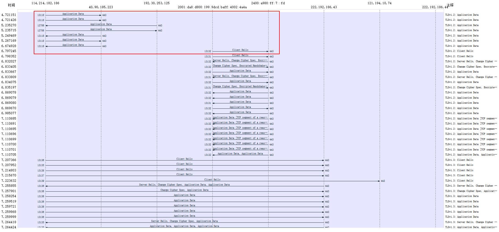

红色框出的是前 8 个帧。

## 2

1. `Content Type`: 1 byte.。
   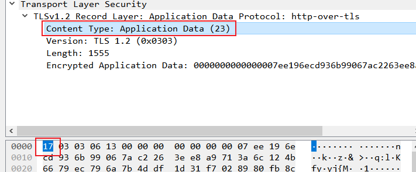
2. `Version`: 2 byte.
   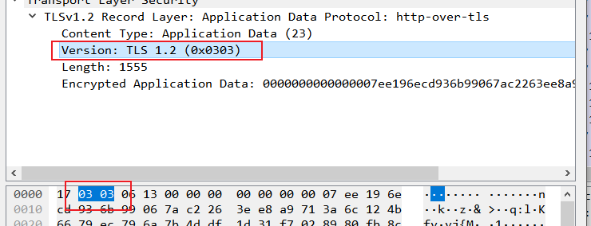
3. `Length`: 2 byte.
   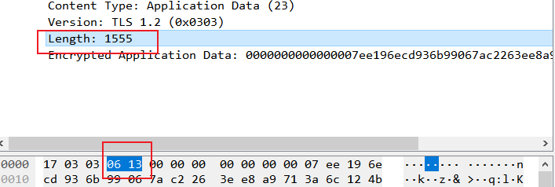

## 3

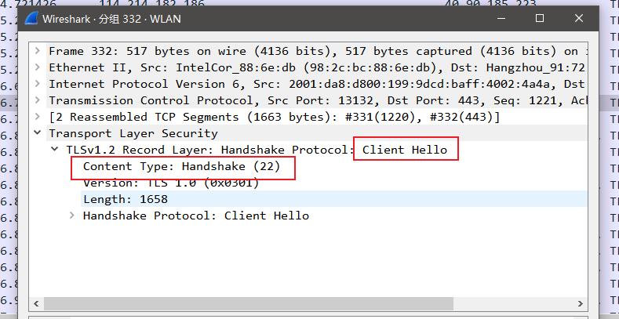

`Content Type` 值为 `22`.

## 4

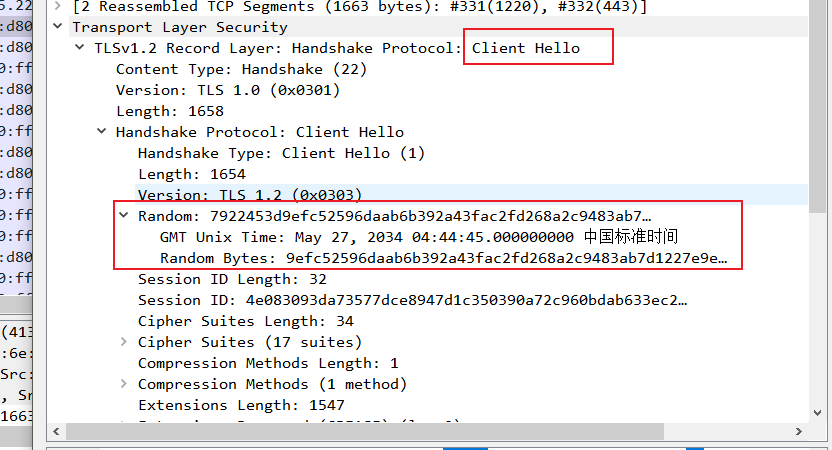

包含，值为 `7922453d9efc52596daab6b392a43fac2fd268a2c9483ab7d1227e9e6300f007`.

## 5

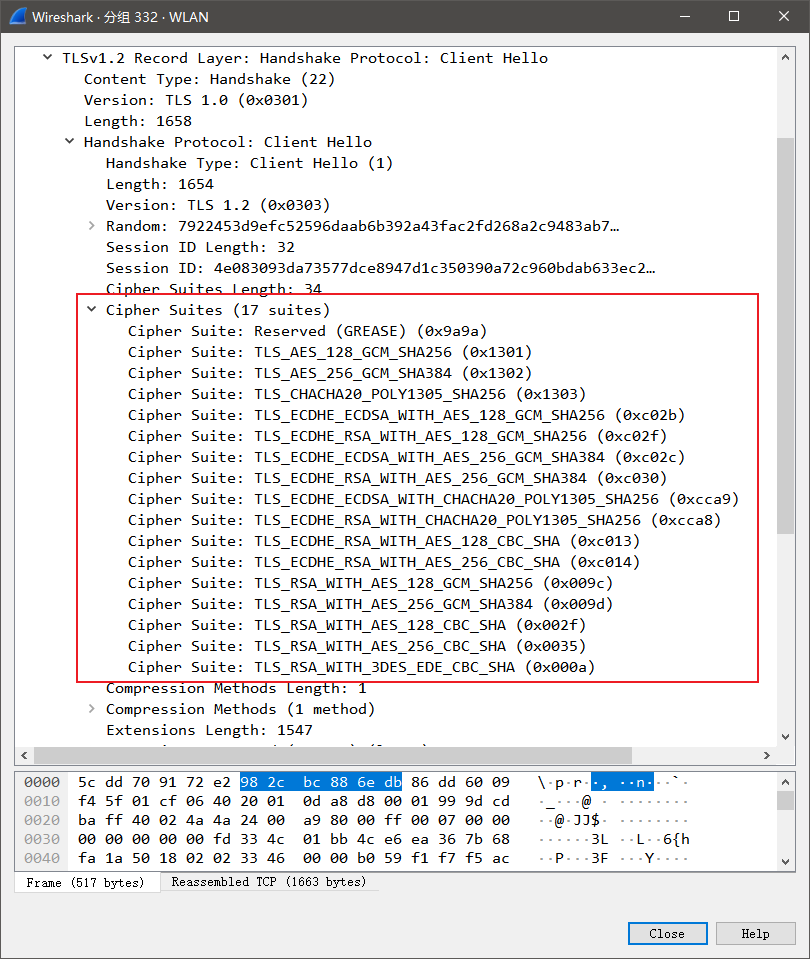

如图，一共列出了 17 个加密套件。

由于第一条是 `Reserved`, 此处选取 `TLS_RSA_WITH_AES_128_GCM_SHA256`.

- 公钥算法：`RSA`
- 对称密钥算法：`AES_128`
- hash 算法：`GCM_SHA256`

## 6

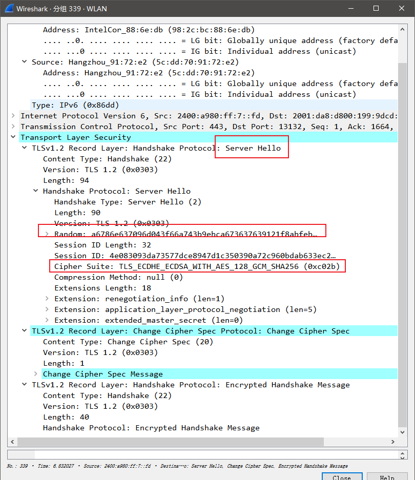

指定了之前的密码套件之一 `TLS_ECDHE_ECDSA_WITH_AES_128_GCM_SHA256`.

- 公钥算法：`ECDHE_ECDSA`
- 对称密钥算法：`AES_128`
- hash 算法：`GCM_SHA256`

## 7

如上题图，包含随机数，值为 `a6786e637096d043f66a743b9ebca673637639121f8abfeb3cb63f959ed78c01`, 长度为 32 bytes.

为了避免回复攻击。

## 8

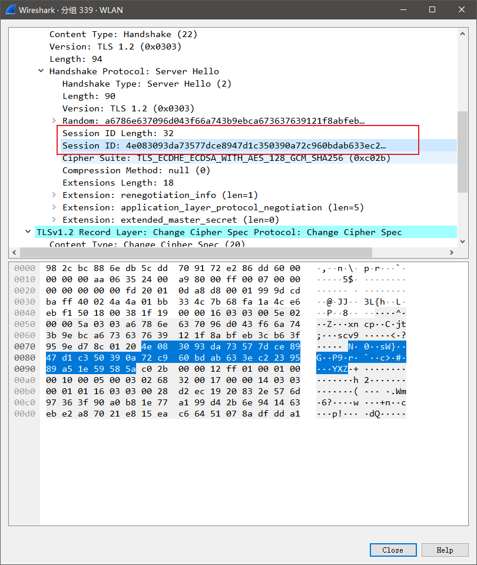

包括 `Session ID`. 用于在一定时间内服务端和客户端快速恢复连接，重新使用密钥数据，跳过 TLS 的一些协商过程。

## 9

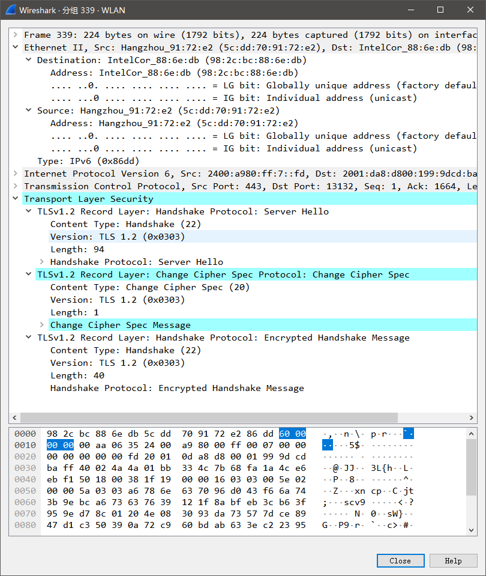

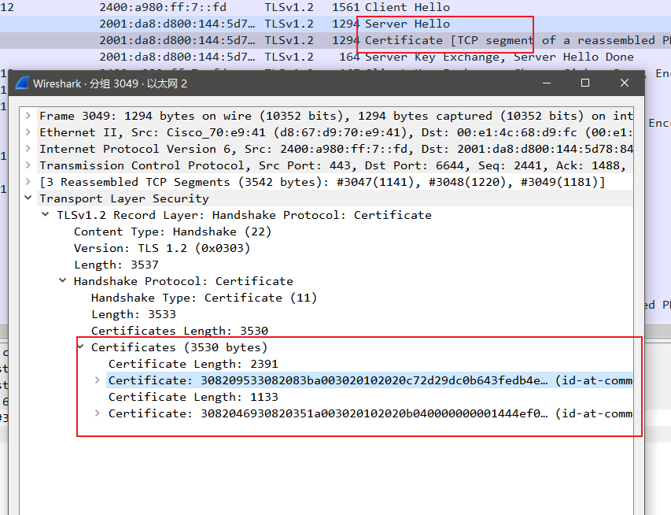

如图，此帧不包含证书，但下一帧中包含证书。并且证书占用一个以太网帧。

## 10

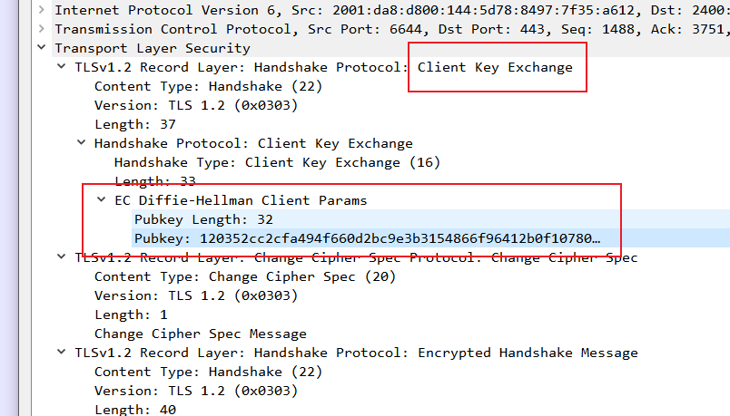

如图，包含前主密钥.

前主密钥被服务器和本机用于产生主密钥。主密钥又被用于产生 MAC 和加密的会话密钥集。

前主密钥被用服务器的公钥加密，用以给服务器让服务器用私钥解密并且使用前面两 个 hello 过程的随机数生成本次的会话加密密钥。

长度为 128 bytes.

## 11

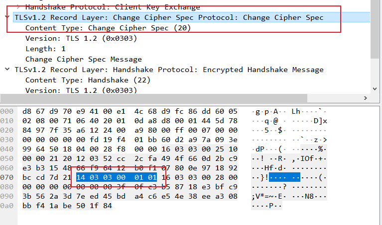

可以看到其长度是 6 bytes.

目的是告诉服务器 b 本机已经计算好加密密钥，以后将会用商定的加密方式和密钥加密传输。

## 12

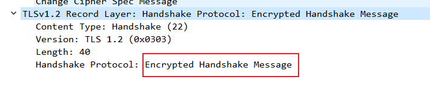

如图，`Handshake message` 是加密的，其中包括消息校验码。这个校验码包含之前所有连接消息的 hash, 只有服务器能够解开，因为在建立连接中，可能存在连接消息被侦听和更改的情况，因此还需要进行 hash 计算和加密传输，判断是否存在异常，如果异常，将会直接关闭连接。

## 13

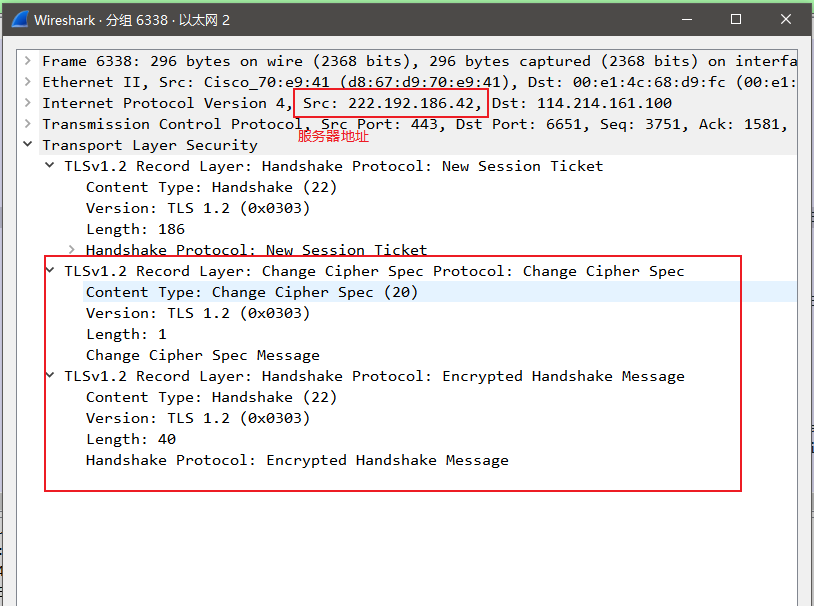

如图，服务器也发送这两种消息。

服务器发送的 `encrypted handshake record` 包含所有服务器发送的数据的 hash 信息，从本机发送的 `encrypted handshake record` 包含所有本机发送的数据的 hash 信息。

## 14

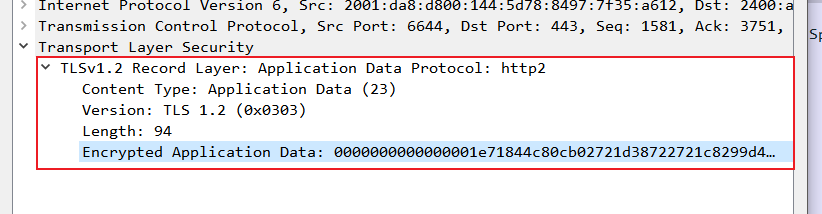

加密使用的是使用本次对话协商和交换好的对称加密密钥。

包含 MAC, 但由于数据被加密，Wireshark 无法区分。

## 15

如上题，消息都被加密，在 `Encrypted Application Data` 中，所以无法区分内容。
