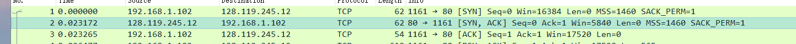
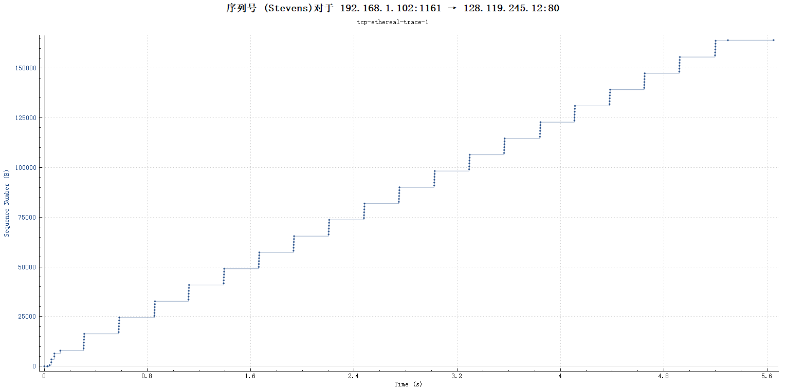
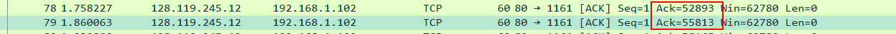
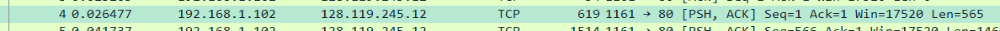
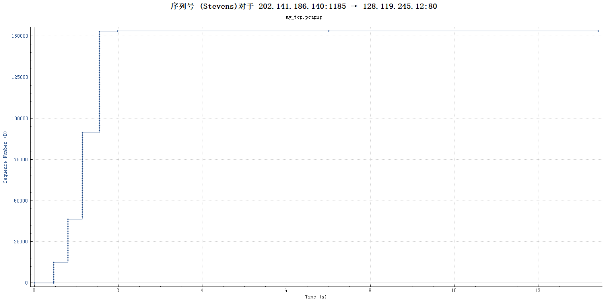

# Computer Networking Lab 5 -- TCP

## 1

`tcp-ethereal-trace-1` 文件中一条由本机发送给 `gaia.cs.umass.edu` 的 TCP 报文的基本信息如下：

```pseudocode
Frame 5: 1514 bytes on wire (12112 bits), 1514 bytes captured (12112 bits)
Ethernet II, Src: Actionte_8a:70:1a (00:20:e0:8a:70:1a), Dst: LinksysG_da:af:73 (00:06:25:da:af:73)
Internet Protocol Version 4, Src: 192.168.1.102, Dst: 128.119.245.12
Transmission Control Protocol, Src Port: 1161, Dst Port: 80, Seq: 566, Ack: 1, Len: 1460
```

可以看出本机 IP 为 `192.168.1.102`, 端口为 `1161`.

## 2

`gaia.cs.umass.edu` 的 IP 地址是 `128.119.245.12`, 使用 `80` 端口收发数据。

## 3

一条由**本机**发送给 `gaia.cs.umass.edu` 的 TCP 报文的基本信息如下：

```pseudocode
Frame 164: 773 bytes on wire (6184 bits), 773 bytes captured (6184 bits) on interface 0
Ethernet II, Src: IntelCor_88:6e:db (98:2c:bc:88:6e:db), Dst: Vmware_9f:00:7f (00:50:56:9f:00:7f)
Internet Protocol Version 4, Src: 202.141.186.140, Dst: 128.119.245.12
Transmission Control Protocol, Src Port: 1185, Dst Port: 80, Seq: 1, Ack: 1, Len: 719
```

可以看出本机 IP 为 `202.141.186.140`, 端口为 `1185`.

## 4

**Notice:** 使用下载的 `tcp-ethereal-trace-1` 文件完成下面所有题目。

首条客户端发送给服务器的 SYN 消息如下：

```pseudocode
Transmission Control Protocol, Src Port: 1161, Dst Port: 80, Seq: 0, Len: 0
    Source Port: 1161
    Destination Port: 80
    [Stream index: 0]
    [TCP Segment Len: 0]
    Sequence number: 0    (relative sequence number)
    [Next sequence number: 0    (relative sequence number)]
    Acknowledgment number: 0
    0111 .... = Header Length: 28 bytes (7)
    Flags: 0x002 (SYN)
        000. .... .... = Reserved: Not set
        ...0 .... .... = Nonce: Not set
        .... 0... .... = Congestion Window Reduced (CWR): Not set
        .... .0.. .... = ECN-Echo: Not set
        .... ..0. .... = Urgent: Not set
        .... ...0 .... = Acknowledgment: Not set
        .... .... 0... = Push: Not set
        .... .... .0.. = Reset: Not set
        .... .... ..1. = Syn: Set
        .... .... ...0 = Fin: Not set
        [TCP Flags: ··········S·]
    Window size value: 16384
    [Calculated window size: 16384]
    Checksum: 0xf6e9 [unverified]
    [Checksum Status: Unverified]
    Urgent pointer: 0
    Options: (8 bytes), Maximum segment size, No-Operation (NOP), No-Operation (NOP), SACK permitted
    [Timestamps]
```

可以看见其中的 `Sequence number` 为 0.

`Flags` 中的 `Syn` 为 1, 代表了此 TCP 报文为 SYN.

## 5

SYNACK 报文的信息如下：

```pseudocode
Transmission Control Protocol, Src Port: 80, Dst Port: 1161, Seq: 0, Ack: 1, Len: 0
    Source Port: 80
    Destination Port: 1161
    [Stream index: 0]
    [TCP Segment Len: 0]
    Sequence number: 0    (relative sequence number)
    [Next sequence number: 0    (relative sequence number)]
    Acknowledgment number: 1    (relative ack number)
    0111 .... = Header Length: 28 bytes (7)
    Flags: 0x012 (SYN, ACK)
        1.   .... .... = Reserved: Not set
        ...0 .... .... = Nonce: Not set
        .... 0... .... = Congestion Window Reduced (CWR): Not set
        .... .0.. .... = ECN-Echo: Not set
        .... ..0. .... = Urgent: Not set
        .... ...1 .... = Acknowledgment: Set
        .... .... 0... = Push: Not set
        .... .... .0.. = Reset: Not set
        .... .... ..1. = Syn: Set
        .... .... ...0 = Fin: Not set
        [TCP Flags: ·······A··S·]
    Window size value: 5840
    [Calculated window size: 5840]
    Checksum: 0x774d [unverified]
    [Checksum Status: Unverified]
    Urgent pointer: 0
    Options: (8 bytes), Maximum segment size, No-Operation (NOP), No-Operation (NOP), SACK permitted
    [SEQ/ACK analysis]
    [Timestamps]
```

可以看出 `Sequence number` 是 0.

`Flags` 中的 `Acknowledgment` 是 1.

`Acknowledgment` 的值是由 `gaia.cs.umass.edu` 在收到的初始 SYN 报文中的 `Sequence number` +1 得到的。

`Flags` 中的 `Syn` 和 `Acknowledgment` 都被设为 1, 代表了这是一个 SYNACK 报文。

## 6

包含 `POST` 的 TCP 报文如下：


它的基本信息如下：

```pseudocode
Transmission Control Protocol, Src Port: 1161, Dst Port: 80, Seq: 1, Ack: 1, Len: 565
    Source Port: 1161
    Destination Port: 80
    [Stream index: 0]
    [TCP Segment Len: 565]
    Sequence number: 1    (relative sequence number)
    [Next sequence number: 566    (relative sequence number)]
    Acknowledgment number: 1    (relative ack number)
    0101 .... = Header Length: 20 bytes (5)
    Flags: 0x018 (PSH, ACK)
    Window size value: 17520
    [Calculated window size: 17520]
    [Window size scaling factor: -2 (no window scaling used)]
    Checksum: 0x1fbd [unverified]
    [Checksum Status: Unverified]
    Urgent pointer: 0
    [SEQ/ACK analysis]
    [Timestamps]
    TCP payload (565 bytes)
```

可以看出 `Sequence number` 是 1.

## 7


| Segment No. | Sequence number | Sent time (s) | ACK received time (s) | RTT (s)  | EstimatedRTT (s) after this segment |
| ----------- | --------------- | ------------- | --------------------- | -------- | ----------------------------------- |
| 1           | 1               | 0.026477      | 0.053937              | 0.02746  | 0.02746                             |
| 2           | 566             | 0.041737      | 0.077294              | 0.035557 | 0.0285                              |
| 3           | 2026            | 0.054026      | 0.124085              | 0.070059 | 0.0337                              |
| 4           | 3486            | 0.054690      | 0.169118              | 0.11443  | 0.0438                              |
| 5           | 4946            | 0.077405      | 0.217299              | 0.13989  | 0.0558                              |
| 6           | 6406            | 0.078157      | 0.267802              | 0.18964  | 0.0725                              |

## 8


| Segment No. | Length (bytes) |
| ----------- | -------------- |
| 1           | 565            |
| 2           | 1460           |
| 3           | 1460           |
| 4           | 1460           |
| 5           | 1460           |
| 6           | 1460           |

## 9



服务器发送第一个 SYNACK 时接收窗口最小，为 5840 bytes.

发送方没有出现过流量限制，因为服务器返回的接收窗口值逐渐变大，没有变为 0.

## 10

没有重发的报文。



如上图，客户端发送的 TCP 报文的序列号单调增大，所以没有重发的报文。

## 11

| ACK No. | ACK sequence number | ACKed data (bytes) |
| ------- | ------------------- | ------------------ |
| 1       | 1                   | 566                |
| 2       | 566                 | 1460               |
| 3       | 2026                | 1460               |
| 4       | 3486                | 1460               |
| 5       | 4946                | 1460               |
| 6       | 6406                | 1460               |

一般情况下每个 ACK 确认的数据是 1460 bytes.



如上图，编号为 79 的 ACK 报文确认的数据是 2920 bytes.

## 12

第一个本机发送的报文（不包含建立连接时）在 `0.026477 s`, 序号为 `1`.



本季最后一个收到的 ACK 在 `5.455830 s`, 序号为 `164091`.


因此平均速度为：

`(164091-1)/(5.455830-0.026477)=30.222 KB/s`

## 13

Time-Sequence-Graph 如下：


TCP 慢启动在连接传输开始时开始。

在整个发送过程中，发送方最多一次性发送 8192 bytes 的数据（从图中可以看出），因此可以断定 TCP 慢启动阶段还没有结束，传送就已经完成了。

同时，连接也没有进入过拥塞控制阶段。

## 14

使用自己抓的包的 Time-Sequence-Graph 如下：



同样的，TCP 慢启动在连接传输开始时开始。

传输过程中每次传输的数据量在不断翻倍，直到最后传输完毕。所以连接还在试探阶段就传输完毕了。传输过程中同样没有到达慢启动阶段的结束。
