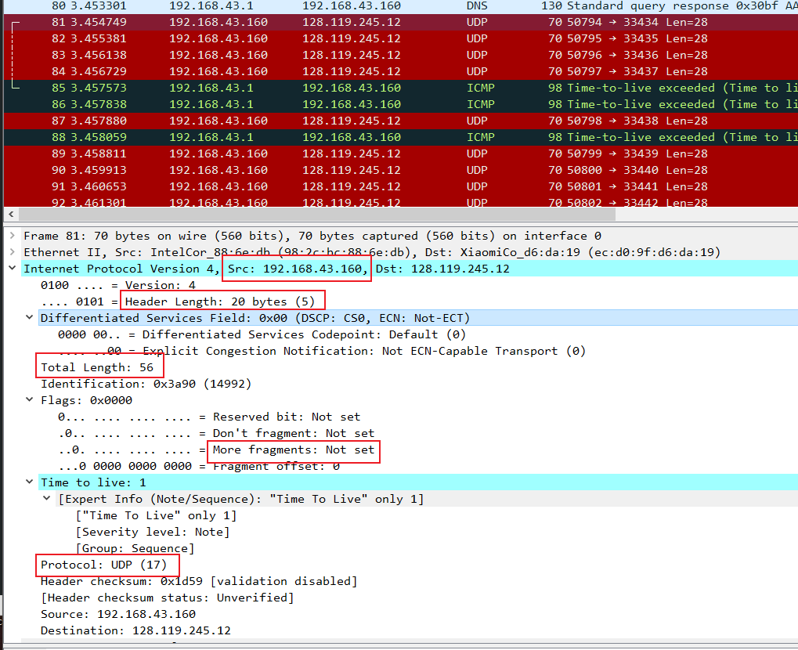
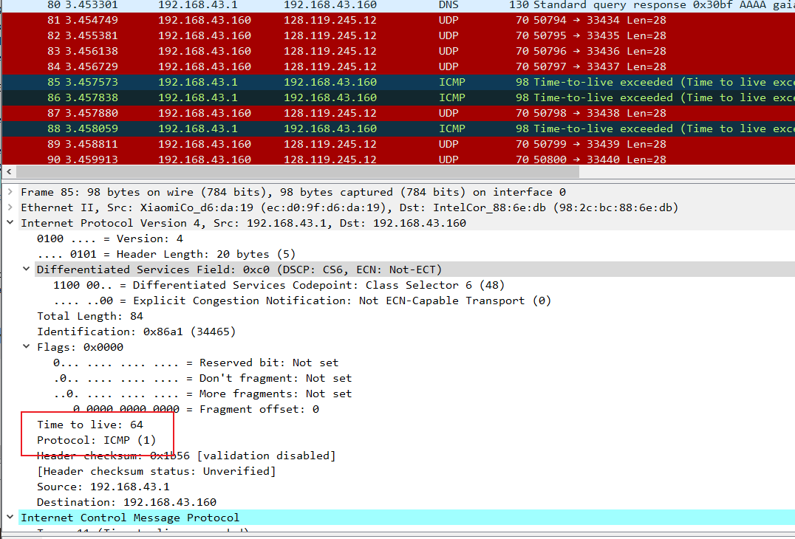
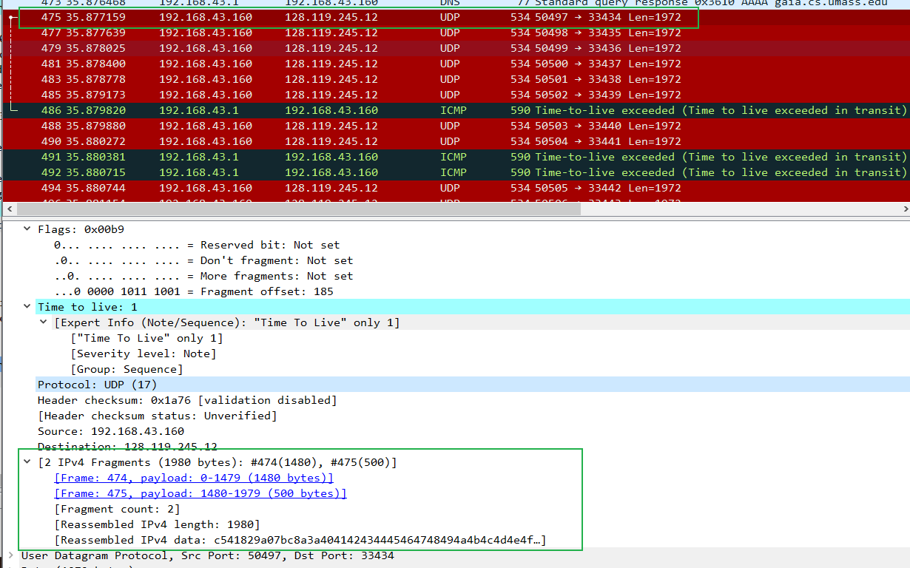
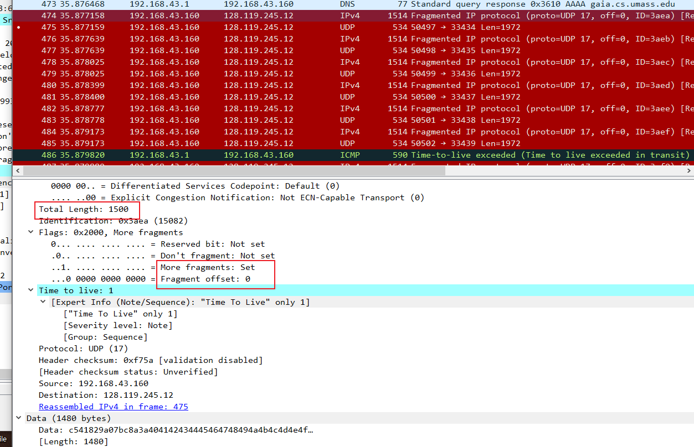
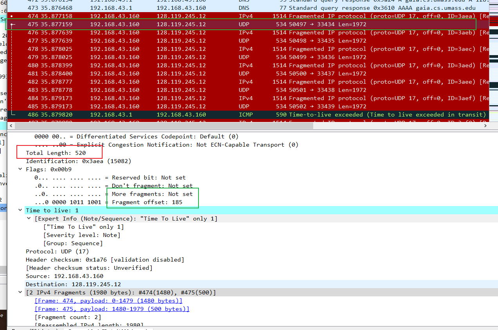
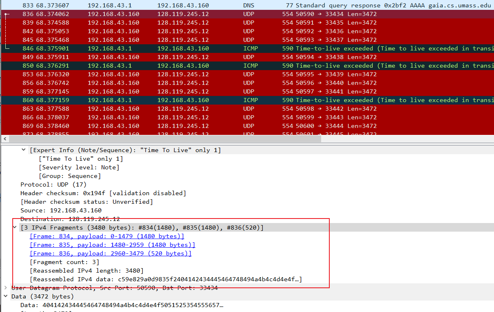
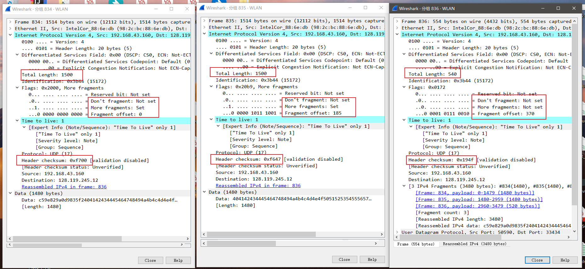

# Computer Networking Lab 7 -- IP

## 1. Select the first ICMP Echo Request message sent by your computer, and expand the Internet Protocol part of the packet in the packet details window. What is the IP address of your computer?

**使用的是 Unix (WSL) 版本的 `traceroute`，本机发送的请求是 UDP, 返回的响应是 ICMP.**

My IP address is `192.168.43.160`.

## 2. Within the IP packet header, what is the value in the upper layer protocol field?

由第 1 题截图，可以看出 upper layer protocol filed 为 `UDP (17)`

## 3. How many bytes are in the IP header? How many bytes are in the payload of the IP datagram? Explain how you determined the number of payload bytes.

由第 1 题截图，IP header 长度是 20 bytes, 总长度为 56 bytes, 所以 payload 长度为 36 bytes.

## 4. Has this IP datagram been fragmented? Explain how you determined whether or not the datagram has been fragmented.

由第 1 题截图，`More fragments` flag 为 `Not set`, 所以没有被分片。

## 5. Which fields in the IP datagram always change from one datagram to the next within this series of ICMP messages sent by your computer?

可以看出每次改变的是 `Identification` 和 `checksum`.

**此处原本应该有`Time To Live`, 原因见下题。**

## 6. Which fields stay constant? Which of the fields must stay constant? Which fields must change? Why?

保持不变的 field 有：

- `Version`
- `Header Length`
- `Differentiated Services`
- `Source IP`
- `Desination IP`
- `Upper Layer Protocol`

必须保持不变的有：

- `Version`
- `Header Length`
- `Differentiated Services`
- `Source IP`
- `Desination IP`
- `Upper Layer Protocol`

必须变化的有：

- `Identification`
- `Header Checksum`

**按照标准情况，`traceroute` 发出的每个包都会让 `Time To Live` 加 1, 但在我抓的包中，每个`Time To Live` 会重复 3 次，构成的序列为 1、1、1、2、2、2、3、3、3……**

**经过我的查询，Linux 下 `traceroute` 有一个默认选项 `-q 3`, 即每个 `Time To Live` 会发送 3 个重复包。**

**因此，若使用 `-q 1`, 则在「必须变化」的 field 中还需要添加 `Time To Live`.**

## 7. Describe the pattern you see in the values in the Identification field of the IP datagram

从本机的发送的请求序列中，`Identification` 每次加 1.

## 8. What is the value in the Identification field and the TTL field?

- `Identification`: `0x86a1`.
- `TTL`: 64.

## 9. Do these values remain unchanged for all of the ICMP TTL-exceeded replies sent to your computer by the nearest (first hop) router? Why?

`Identification` 始终会改变，因为 `identification` 是唯一的，除非大的 IP 数据包被分片，各分片共享，`identification`, 但 `ICMP` 的数据包不足以引发分片。

`TTL` 始终不变，因为第一跳的路由器始终相同。

## 10. Find the first ICMP Echo Request message that was sent by your computer after you changed the Packet Size in pingplotter to be 2000. Has that message been fragmented across more than one IP datagram? 

如图，数据包被分片为 `1480` 和 `500` 两片。

## 11. Print out the first fragment of the fragmented IP datagram. What information in the IP header indicates that the datagram been fragmented? What information in the IP header indicates whether this is the first fragment versus a latter fragment? How long is this IP datagram?

`More fragment` 为 `Set`, 说明数据包被分片。

`Fragment Offset` 为 `0`, 说明为第一个分片。

总长度为 1500 bytes.

## 12. Print out the second fragment of the fragmented IP datagram. What information in the IP header indicates that this is not the first datagram fragment? Are the more fragments? How can you tell?

第二个分片的信息如上。

`Fragment Offset` 不为 `0` 说明不是第一个分片。

`More fragment` 为 `Not Set`, 说明没有更多的分片。

## 13. What fields change in the IP header between the first and second fragment?

由 11 和 12 题图，变化的包括 `More fragment`、`Fragment Offset` 和 `Total Length`.

## 14. How many fragments were created from the original datagram?

3 个分片。

## 15. What fields change in the IP header among the fragments?

第 1 和 2 之间的不同有 `Fragment Offset` 和 `Checksum`.

第 1、2 和 3 之间的不同有 `Total Length`、`Fragment Offset`、`More Fragment` 和 `Checksum`.
