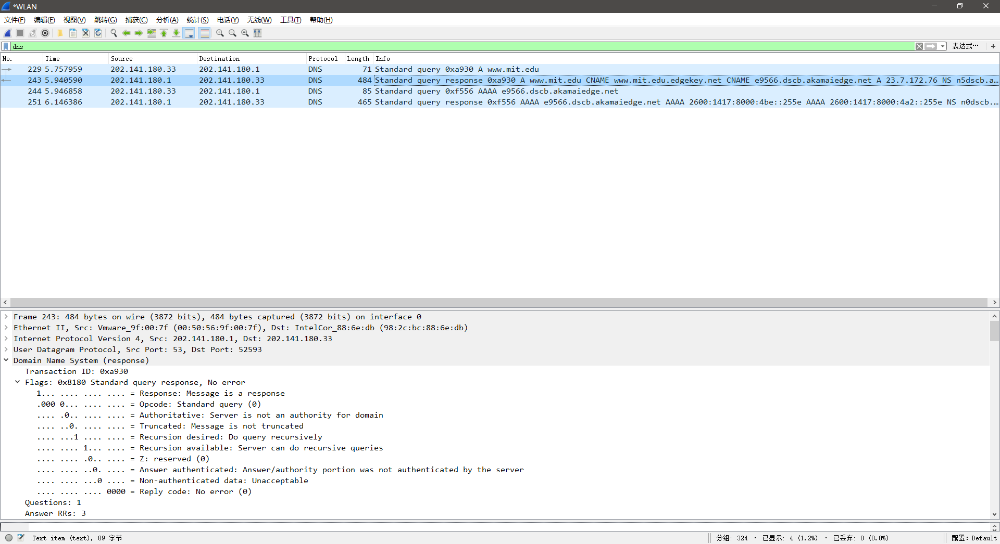
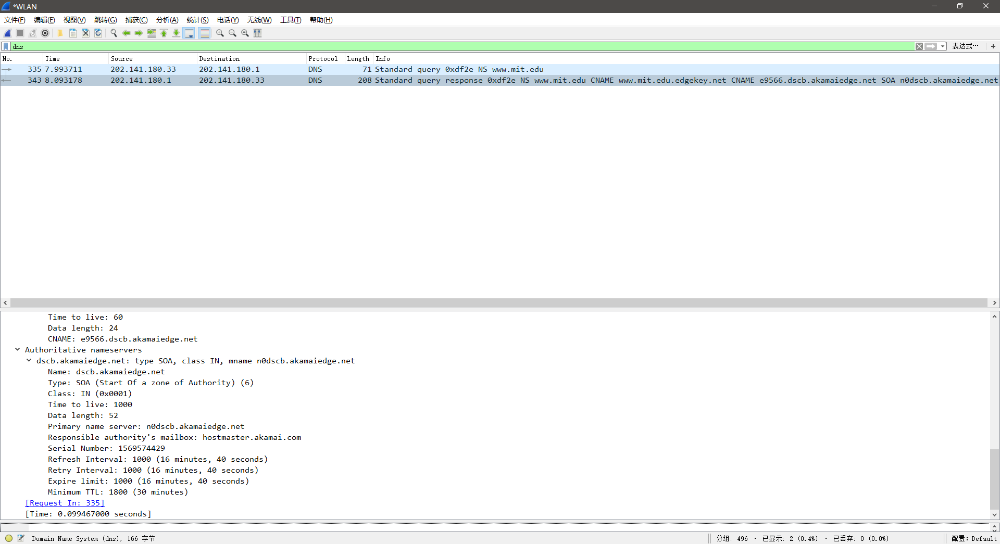
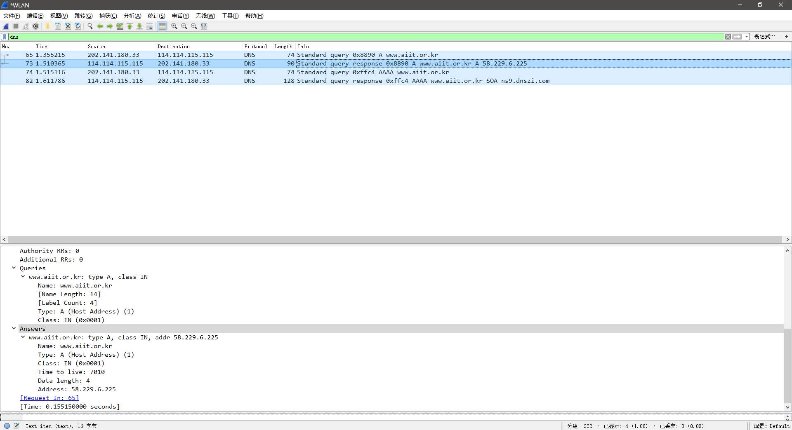

# Computer Networking Lab -- DNS

## 1. Run nslookup to obtain the IP address of a Web server in Asia. 

```shell
$ nslookup www.ustc.edu.cn
Server:         202.141.180.1
Address:        202.141.180.1#53

Non-authoritative answer:
Name:   www.ustc.edu.cn
Address: 202.38.64.246
Name:   www.ustc.edu.cn
Address: 2001:da8:d800:642::246
```

IP address:

- IPv4: `202.38.64.246`
- IPv6: `2001:da8:d800:642::246`

## 2. Run nslookup to determine the authoritative DNS servers for a university in Europe.

```shell
$ nslookup -type=NS msu.ru
Server:         202.141.180.1
Address:        202.141.180.1#53

Non-authoritative answer:
msu.ru  nameserver = ns.msu.net.
msu.ru  nameserver = ns3.nic.fr.
msu.ru  nameserver = ns.msu.ru.

Authoritative answers can be found from:
ns3.nic.fr      internet address = 192.134.0.49
ns3.nic.fr      has AAAA address 2001:660:3006:1::1:1
ns.msu.ru       internet address = 93.180.0.1
ns.msu.net      internet address = 212.16.0.1

$ nslookup -type=NS msu.ru ns.msu.ru
Server:         ns.msu.ru
Address:        93.180.0.1#53

msu.ru  nameserver = ns.msu.net.
msu.ru  nameserver = ns3.nic.fr.
msu.ru  nameserver = ns.msu.ru.
```

## 3. Run nslookup so that one of the DNS servers obtained in Question 2 is queried for the mail servers for Yahoo! mail.

```shell
$ nslookup mail.yahoo.com ns.msu.ru
Server:         ns.msu.ru
Address:        93.180.0.1#53

** server can't find mail.yahoo.com: REFUSED
```

由于 `ns.msu.ru` 关闭了递归查询，因此只能查询 `msu.ru` 下的子域名，如

```shell
$ nslookup phys.msu.ru ns.msu.ru
Server:         ns.msu.ru
Address:        93.180.0.1#53

Name:   phys.msu.ru
Address: 93.180.53.207
```

`mail.yahoo.com` 不在此范围内，因此被拒绝。

为避免错误，使用 `ns.ustc.edu.cn` 完成实验：

```shell
$ nslookup mail.yahoo.com ns.ustc.edu.cn
Server:         ns.ustc.edu.cn
Address:        202.38.64.1#53

Non-authoritative answer:
mail.yahoo.com  canonical name = fd-geoycpi-uno.gycpi.b.yahoodns.net.
Name:   fd-geoycpi-uno.gycpi.b.yahoodns.net
Address: 209.73.190.12
Name:   fd-geoycpi-uno.gycpi.b.yahoodns.net
Address: 209.73.190.11
Name:   fd-geoycpi-uno.gycpi.b.yahoodns.net
Address: 2001:4998:28:800::4001
Name:   fd-geoycpi-uno.gycpi.b.yahoodns.net
Address: 2001:4998:28:800::4000
```

## 4. Locate the DNS query and response messages. Are then sent over UDP or TCP? 

Query message:

```dns
Domain Name System (query)
    Transaction ID: 0x4293
    Flags: 0x0100 Standard query
        0... .... .... .... = Response: Message is a query
        .000 0... .... .... = Opcode: Standard query (0)
        .... ..0. .... .... = Truncated: Message is not truncated
        .... ...1 .... .... = Recursion desired: Do query recursively
        .... .... .0.. .... = Z: reserved (0)
        .... .... ...0 .... = Non-authenticated data: Unacceptable
    Questions: 1
    Answer RRs: 0
    Authority RRs: 0
    Additional RRs: 0
    Queries
        www.ietf.org: type AAAA, class IN
            Name: www.ietf.org
            [Name Length: 12]
            [Label Count: 3]
            Type: AAAA (IPv6 Address) (28)
            Class: IN (0x0001)
    [Response In: 123]
```

Network layer message:

```dns
Internet Protocol Version 4, Src: 202.141.180.33, Dst: 202.141.180.1
    0100 .... = Version: 4
    .... 0101 = Header Length: 20 bytes (5)
    Differentiated Services Field: 0x00 (DSCP: CS0, ECN: Not-ECT)
    Total Length: 58
    Identification: 0x0ddb (3547)
    Flags: 0x0000
    Time to live: 128
    Protocol: UDP (17)
    Header checksum: 0x2f9a [validation disabled]
    [Header checksum status: Unverified]
    Source: 202.141.180.33
    Destination: 202.141.180.1
```

Query message was sent over `UDP`.

## 5. What is the destination port for the DNS query message? What is the source port of DNS response message?

Query message:

```dns
User Datagram Protocol, Src Port: 62915, Dst Port: 53
```

Response message:

```dns
User Datagram Protocol, Src Port: 53, Dst Port: 62915
```

Destination port for the DNS query message and source port of DNS response message are both `53`.

## 6. To what IP address is the DNS query message sent? Use ipconfig to determine the IP address of your local DNS server. Are these two IP addresses the same?

```dns
Internet Protocol Version 4, Src: 202.141.180.33, Dst: 202.141.180.1
```

DNS query message is sent to `202.141.180.1`.

```cmd
> ipconfig /all

Windows IP 配置

   主机名  . . . . . . . . . . . . . : Monsoon-PC
   主 DNS 后缀 . . . . . . . . . . . :
   节点类型  . . . . . . . . . . . . : 混合
   IP 路由已启用 . . . . . . . . . . : 否
   WINS 代理已启用 . . . . . . . . . : 否
   DNS 后缀搜索列表  . . . . . . . . : ustc.edu.cn

无线局域网适配器 WLAN:

   连接特定的 DNS 后缀 . . . . . . . : ustc.edu.cn
   描述. . . . . . . . . . . . . . . : Intel(R) Dual Band Wireless-AC 8265
   物理地址. . . . . . . . . . . . . : 98-2C-BC-88-6E-DB
   DHCP 已启用 . . . . . . . . . . . : 是
   自动配置已启用. . . . . . . . . . : 是
   IPv6 地址 . . . . . . . . . . . . : 2001:da8:d800:195:29cd:844c:8dc2:afb7(首选)
   临时 IPv6 地址. . . . . . . . . . : 2001:da8:d800:195:e40d:5260:fa0c:b67(首选)
   本地链接 IPv6 地址. . . . . . . . : fe80::29cd:844c:8dc2:afb7%5(首选)
   IPv4 地址 . . . . . . . . . . . . : 202.141.180.33(首选)
   子网掩码  . . . . . . . . . . . . : 255.255.255.0
   获得租约的时间  . . . . . . . . . : 2019年9月27日, 星期五 15:41:03
   租约过期的时间  . . . . . . . . . : 2019年9月27日, 星期五 16:21:04
   默认网关. . . . . . . . . . . . . : fe80::f225:72ff:fea8:fe41%5
                                       202.141.180.1
   DHCP 服务器 . . . . . . . . . . . : 202.141.180.1
   DHCPv6 IAID . . . . . . . . . . . : 95710204
   DHCPv6 客户端 DUID  . . . . . . . : 00-01-00-01-24-FB-FE-A3-98-2C-BC-88-6E-DB
   DNS 服务器  . . . . . . . . . . . : 202.141.180.1
   TCPIP 上的 NetBIOS  . . . . . . . : 已启用
```

Local DNS server is `202.141.180.1`, same as the query message destination.

## 7. Examine the DNS query message. What “Type” of DNS query is it? Does the query message contain any “answers”?

```dns
Domain Name System (query)
    Transaction ID: 0x4293
    Flags: 0x0100 Standard query
        0... .... .... .... = Response: Message is a query
        .000 0... .... .... = Opcode: Standard query (0)
        .... ..0. .... .... = Truncated: Message is not truncated
        .... ...1 .... .... = Recursion desired: Do query recursively
        .... .... .0.. .... = Z: reserved (0)
        .... .... ...0 .... = Non-authenticated data: Unacceptable
    Questions: 1
    Answer RRs: 0
    Authority RRs: 0
    Additional RRs: 0
    Queries
        www.ietf.org: type AAAA, class IN
            Name: www.ietf.org
            [Name Length: 12]
            [Label Count: 3]
            Type: AAAA (IPv6 Address) (28)
            Class: IN (0x0001)
    [Response In: 123]
```

Type is `AAAA`. 

Query message contain no “answers”.

## 8. Examine the DNS response message. How many “answers” are provided? What do each of these answers contain?

3 answers are provided.

The are following:

```dns
Answers
    www.ietf.org: type CNAME, class IN, cname www.ietf.org.cdn.cloudflare.net
        Name: www.ietf.org
        Type: CNAME (Canonical NAME for an alias) (5)
        Class: IN (0x0001)
        Time to live: 205
        Data length: 33
        CNAME: www.ietf.org.cdn.cloudflare.net
    www.ietf.org.cdn.cloudflare.net: type AAAA, class IN, addr 2606:4700:10::6814:155
        Name: www.ietf.org.cdn.cloudflare.net
        Type: AAAA (IPv6 Address) (28)
        Class: IN (0x0001)
        Time to live: 205
        Data length: 16
        AAAA Address: 2606:4700:10::6814:155
    www.ietf.org.cdn.cloudflare.net: type AAAA, class IN, addr 2606:4700:10::6814:55
        Name: www.ietf.org.cdn.cloudflare.net
        Type: AAAA (IPv6 Address) (28)
        Class: IN (0x0001)
        Time to live: 205
        Data length: 16
        AAAA Address: 2606:4700:10::6814:55
```

## 9. Consider the subsequent TCP SYN packet sent by your host. Does the destination IP address of the SYN packet correspond to any of the IP addresses provided in the DNS response message?

```dns
Internet Protocol Version 6, Src: 2001:da8:d800:195:e40d:5260:fa0c:b67, Dst: 2606:4700:10::6814:155
```

Desination IP address is `2606:4700:10::6814:155`.

Yes.

## 10. This web page contains images. Before retrieving each image, does your host issue new DNS queries?

No. Images are at the same domain name with HTML file, So it's not necessary to repeat DNS query.

## 11. What is the destination port for the DNS query message? What is the source port of DNS response message?

Query:

```dns
User Datagram Protocol, Src Port: 49355, Dst Port: 53
```

Response:

```dns
User Datagram Protocol, Src Port: 53, Dst Port: 49355
```

They are both `53`.

## 12. To what IP address is the DNS query message sent? Is this the IP address of your default local DNS server?

```dns
Internet Protocol Version 4, Src: 202.141.180.33, Dst: 202.141.180.1
```

DNS query is sent to `202.141.180.1`, same with local DNS server.

## 13. Examine the DNS query message. What “Type” of DNS query is it? Does the query message contain any “answers”?

```dns
Domain Name System (query)
    Transaction ID: 0x2985
    Flags: 0x0100 Standard query
        0... .... .... .... = Response: Message is a query
        .000 0... .... .... = Opcode: Standard query (0)
        .... ..0. .... .... = Truncated: Message is not truncated
        .... ...1 .... .... = Recursion desired: Do query recursively
        .... .... .0.. .... = Z: reserved (0)
        .... .... ...0 .... = Non-authenticated data: Unacceptable
    Questions: 1
    Answer RRs: 0
    Authority RRs: 0
    Additional RRs: 0
    Queries
        www.mit.edu: type A, class IN
            Name: www.mit.edu
            [Name Length: 11]
            [Label Count: 3]
            Type: A (Host Address) (1)
            Class: IN (0x0001)
    [Response In: 399]
```

Type is `A`.

Query message contain no “answers”.

## 14. Examine the DNS response message. How many “answers” are provided? What do each of these answers contain?

3 answers.

The are following:

```dns
Answers
    www.mit.edu: type CNAME, class IN, cname www.mit.edu.edgekey.net
        Name: www.mit.edu
        Type: CNAME (Canonical NAME for an alias) (5)
        Class: IN (0x0001)
        Time to live: 1800
        Data length: 25
        CNAME: www.mit.edu.edgekey.net
    www.mit.edu.edgekey.net: type CNAME, class IN, cname e9566.dscb.akamaiedge.net
        Name: www.mit.edu.edgekey.net
        Type: CNAME (Canonical NAME for an alias) (5)
        Class: IN (0x0001)
        Time to live: 60
        Data length: 24
        CNAME: e9566.dscb.akamaiedge.net
    e9566.dscb.akamaiedge.net: type A, class IN, addr 23.7.172.76
        Name: e9566.dscb.akamaiedge.net
        Type: A (Host Address) (1)
        Class: IN (0x0001)
        Time to live: 20
        Data length: 4
        Address: 23.7.172.76
```

## 15. Provide a screenshot.



## 16. To what IP address is the DNS query message sent? Is this the IP address of your default local DNS server?

```shell
$ nslookup -type=NS www.mit.edu
Server:         202.141.180.1
Address:        202.141.180.1#53

Non-authoritative answer:
www.mit.edu     canonical name = www.mit.edu.edgekey.net.
www.mit.edu.edgekey.net canonical name = e9566.dscb.akamaiedge.net.

Authoritative answers can be found from:
dscb.akamaiedge.net
        origin = n0dscb.akamaiedge.net
        mail addr = hostmaster.akamai.com
        serial = 1569576682
        refresh = 1000
        retry = 1000
        expire = 1000
        minimum = 1800
```

```dns
Internet Protocol Version 4, Src: 202.141.180.33, Dst: 202.141.180.1
```

DNS query is sent to `202.141.180.1`, same with local DNS server.

## 17. Examine the DNS query message. What “Type” of DNS query is it? Does the query message contain any “answers”?

```dns
Domain Name System (query)
    Transaction ID: 0xdf2e
    Flags: 0x0100 Standard query
        0... .... .... .... = Response: Message is a query
        .000 0... .... .... = Opcode: Standard query (0)
        .... ..0. .... .... = Truncated: Message is not truncated
        .... ...1 .... .... = Recursion desired: Do query recursively
        .... .... .0.. .... = Z: reserved (0)
        .... .... ...0 .... = Non-authenticated data: Unacceptable
    Questions: 1
    Answer RRs: 0
    Authority RRs: 0
    Additional RRs: 0
    Queries
        www.mit.edu: type NS, class IN
            Name: www.mit.edu
            [Name Length: 11]
            [Label Count: 3]
            Type: NS (authoritative Name Server) (2)
            Class: IN (0x0001)
    [Response In: 343]
```

Type is `A`.

Query message contain no “answers”.

## 18. Examine the DNS response message. What MIT nameservers does the response message provide? Does this response message also provide the IP addresses of the MIT namesers?

```dns
Domain Name System (response)
    Transaction ID: 0xdf2e
    Flags: 0x8180 Standard query response, No error
        1... .... .... .... = Response: Message is a response
        .000 0... .... .... = Opcode: Standard query (0)
        .... .0.. .... .... = Authoritative: Server is not an authority for domain
        .... ..0. .... .... = Truncated: Message is not truncated
        .... ...1 .... .... = Recursion desired: Do query recursively
        .... .... 1... .... = Recursion available: Server can do recursive queries
        .... .... .0.. .... = Z: reserved (0)
        .... .... ..0. .... = Answer authenticated: Answer/authority portion was not authenticated by the server
        .... .... ...0 .... = Non-authenticated data: Unacceptable
        .... .... .... 0000 = Reply code: No error (0)
    Questions: 1
    Answer RRs: 2
    Authority RRs: 1
    Additional RRs: 0
    Queries
        www.mit.edu: type NS, class IN
            Name: www.mit.edu
            [Name Length: 11]
            [Label Count: 3]
            Type: NS (authoritative Name Server) (2)
            Class: IN (0x0001)
    Answers
        www.mit.edu: type CNAME, class IN, cname www.mit.edu.edgekey.net
            Name: www.mit.edu
            Type: CNAME (Canonical NAME for an alias) (5)
            Class: IN (0x0001)
            Time to live: 1329
            Data length: 25
            CNAME: www.mit.edu.edgekey.net
        www.mit.edu.edgekey.net: type CNAME, class IN, cname e9566.dscb.akamaiedge.net
            Name: www.mit.edu.edgekey.net
            Type: CNAME (Canonical NAME for an alias) (5)
            Class: IN (0x0001)
            Time to live: 60
            Data length: 24
            CNAME: e9566.dscb.akamaiedge.net
    Authoritative nameservers
        dscb.akamaiedge.net: type SOA, class IN, mname n0dscb.akamaiedge.net
            Name: dscb.akamaiedge.net
            Type: SOA (Start Of a zone of Authority) (6)
            Class: IN (0x0001)
            Time to live: 1000
            Data length: 52
            Primary name server: n0dscb.akamaiedge.net
            Responsible authority's mailbox: hostmaster.akamai.com
            Serial Number: 1569574429
            Refresh Interval: 1000 (16 minutes, 40 seconds)
            Retry Interval: 1000 (16 minutes, 40 seconds)
            Expire limit: 1000 (16 minutes, 40 seconds)
            Minimum TTL: 1800 (30 minutes)
    [Request In: 335]
    [Time: 0.099467000 seconds]
```

Response message provides nameserver `dscb.akamaiedge.net`.

No IP address of nameserver.

## 19. Provide a screenshot.



## 20. To what IP address is the DNS query message sent? Is this the IP address of your default local DNS server? If not, what does the IP address correspond to?

**Note: Because DNS service of `bitsy.mit.com` has been stopped, I replace it with `public2.114dns.com` to solve problem 20 ~ 23.**

```shell
$ nslookup www.aiit.or.kr bitsy.mit.edu
;; connection timed out; no servers could be reached

$ nslookup www.aiit.or.kr public2.114dns.com
Server:         public2.114dns.com
Address:        114.114.115.115#53

Non-authoritative answer:
Name:   www.aiit.or.kr
Address: 58.229.6.225
```

```dns
Internet Protocol Version 4, Src: 202.141.180.33, Dst: 114.114.115.115
```

DNS query message is sent to `114.114.115.115`.

```shell
$ nslookup 114.114.115.115
115.115.114.114.in-addr.arpa    name = public2.114dns.com.

Authoritative answers can be found from:
115.114.114.in-addr.arpa        nameserver = ns100.114dns.com.
115.114.114.in-addr.arpa        nameserver = ns100.114dns.net.
```

`114.114.115.115` correspond to `public2.114dns.com`.

## 21. Examine the DNS query message. What “Type” of DNS query is it? Does the query message contain any “answers”?

```dns
Domain Name System (query)
    Transaction ID: 0x710e
    Flags: 0x0100 Standard query
        0... .... .... .... = Response: Message is a query
        .000 0... .... .... = Opcode: Standard query (0)
        .... ..0. .... .... = Truncated: Message is not truncated
        .... ...1 .... .... = Recursion desired: Do query recursively
        .... .... .0.. .... = Z: reserved (0)
        .... .... ...0 .... = Non-authenticated data: Unacceptable
    Questions: 1
    Answer RRs: 0
    Authority RRs: 0
    Additional RRs: 0
    Queries
        www.aiit.or.kr: type A, class IN
            Name: www.aiit.or.kr
            [Name Length: 14]
            [Label Count: 4]
            Type: A (Host Address) (1)
            Class: IN (0x0001)
    [Response In: 888]
```

Query message contain no “answers”.

## 22. Examine the DNS response message. How many “answers” are provided? What does each of these answers contain?

1 answer.

The are following:

```dns
Answers
    www.aiit.or.kr: type A, class IN, addr 58.229.6.225
        Name: www.aiit.or.kr
        Type: A (Host Address) (1)
        Class: IN (0x0001)
        Time to live: 6139
        Data length: 4
        Address: 58.229.6.225
```

## 23. Provide a screenshot.


