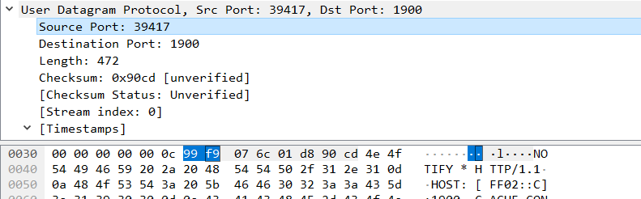

# Computer Networking Lab 4 -- UDP

## 1. Select one UDP packet from your trace. From this packet, determine how many fields there are in the UDP header. (You shouldn’t look in the textbook! Answer these questions directly from what you observe in the packet trace.) Name these fields.

```udp
User Datagram Protocol, Src Port: 39417, Dst Port: 1900
    Source Port: 39417
    Destination Port: 1900
    Length: 472
    Checksum: 0x90cd [unverified]
    [Checksum Status: Unverified]
    [Stream index: 0]
    [Timestamps]
        [Time since first frame: 0.000000000 seconds]
        [Time since previous frame: 0.000000000 seconds]
```

There are 4 fields:

- `Source Port`
- `Destination Port`
- `Length`
- `Checksum`

## 2. By consulting the displayed information in Wireshark’s packet content field for this packet, determine the length (in bytes) of each of the UDP header fields.



The length of each UDP header field is 2 bytes.

## 3. The value in the Length field is the length of what? (You can consult the text for this answer). Verify your claim with your captured UDP packet.

The value in the Length field is the length of whole UDP message, including 4 headers and the following application data (正文).

Headers:

```udp
User Datagram Protocol, Src Port: 39417, Dst Port: 1900
    Source Port: 39417
    Destination Port: 1900
    Length: 472
    Checksum: 0x90cd [unverified]
    [Checksum Status: Unverified]
    [Stream index: 0]
    [Timestamps]
        [Time since first frame: 0.000000000 seconds]
        [Time since previous frame: 0.000000000 seconds]
```

The length of 4 headers is 8 bytes.

Application data:

```udp
NOTIFY * HTTP/1.1\r\n
HOST: [FF02::C]:1900\r\n
CACHE-CONTROL: max-age=60\r\n
LOCATION: http://[fd35:d87d:76c7::1]:5000/rootDesc.xml\r\n
SERVER: OpenWRT/OpenWrt UPnP/2.0 MiniUPnPd/1.9\r\n
NT: urn:schemas-upnp-org:service:Layer3Forwarding:1\r\n
USN: uuid:56a8efc4-8c5e-43c5-abc8-cc448a901944::urn:schemas-upnp-org:service:Layer3Forwarding:1\r\n
NTS: ssdp:alive\r\n
OPT: "http://schemas.upnp.org/upnp/1/0/"; ns=01\r\n
01-NLS: 1509083035\r\n
BOOTID.UPNP.ORG: 1509083035\r\n
CONFIGID.UPNP.ORG: 1337\r\n
\r\n
```

The length of application data is 464 bytes.

The sum of them is 472, which eqauls to Length filed.

## 4. What is the maximum number of bytes that can be included in a UDP payload? (Hint: the answer to this question can be determined by your answer to 2. above)

Maximun number of bytes is $2^{16}-1-4 \times 2=65527$.

## 5. What is the largest possible source port number? (Hint: see the hint in 4.)

$2^{16}-1=65536$.

## 6. What is the protocol number for UDP? Give your answer in both hexadecimal and decimal notation. To answer this question, you’ll need to look into the Protocol field of the IP datagram containing this UDP segment (see Figure 4.13 in the text, and the discussion of IP header fields).

```udp
Internet Protocol Version 6, Src: fe80::52bd:5fff:fe1a:c572, Dst: ff02::c
    0110 .... = Version: 6
    .... 0000 0000 .... .... .... .... .... = Traffic Class: 0x00 (DSCP: CS0, ECN: Not-ECT)
    .... .... .... 0000 0000 0000 0000 0000 = Flow Label: 0x00000
    Payload Length: 472
    Next Header: UDP (17)
    Hop Limit: 1
    Source: fe80::52bd:5fff:fe1a:c572
    Destination: ff02::c
    [Source SA MAC: Tp-LinkT_1a:c5:72 (50:bd:5f:1a:c5:72)]
```

`Next Header: UDP (17)` indicates that protocol number for UDP is `17` (decimal) or `0x11` (hexadecimal).

## 7. Examine a pair of UDP packets in which your host sends the first UDP packet and the second UDP packet is a reply to this first UDP packet. (Hint: for a second packet to be sent in response to a first packet, the sender of the first packet should be the destination of the second packet). Describe the relationship between the port numbers in the two packets.

Sent:

```udp
User Datagram Protocol, Src Port: 53, Dst Port: 51504
    Source Port: 53
    Destination Port: 51504
    Length: 34
    Checksum: 0xfbef [unverified]
    [Checksum Status: Unverified]
    [Stream index: 6]
    [Timestamps]
        [Time since first frame: 0.000000000 seconds]
        [Time since previous frame: 0.000000000 seconds]
```

Received:

```udp
User Datagram Protocol, Src Port: 53, Dst Port: 51504
    Source Port: 53
    Destination Port: 51504
    Length: 34
    Checksum: 0xfbef [unverified]
    [Checksum Status: Unverified]
    [Stream index: 6]
    [Timestamps]
        [Time since first frame: 0.022883000 seconds]
        [Time since previous frame: 0.022883000 seconds]
```

Source port of sent packet is same as Destination port of received packet.

Source port of received packet is same as Destination port of sent packet.
