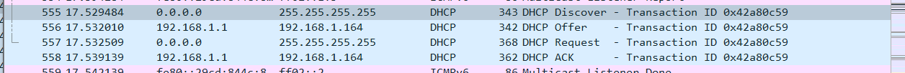

# Computer Networking Lab 6 -- DHCP

## 1

Each DHCP message is sent over UDP.

## 2

下图中前四次交换即使要找的 Discover/Offer/Request/ACK 数据交换：


| Message  | Source Port | Destination Port |
| -------- | ----------- | ---------------- |
| Discover | 68          | 67               |
| Offer    | 67          | 68               |
| Request  | 68          | 67               |
| ACK      | 67          | 68               |

与给出的例子一致。

## 3

Link-layer address is `98:2c:bc:88:6e:db`.

```dhcp
Ethernet II, Src: IntelCor_88:6e:db (98:2c:bc:88:6e:db), Dst: Broadcast (ff:ff:ff:ff:ff:ff)
    Destination: Broadcast (ff:ff:ff:ff:ff:ff)
    Source: IntelCor_88:6e:db (98:2c:bc:88:6e:db)
    Type: IPv4 (0x0800)
```

## 4

Discover 报文内容如下：

```dhcp
Dynamic Host Configuration Protocol (Discover)
    Message type: Boot Request (1)
    Hardware type: Ethernet (0x01)
    Hardware address length: 6
    Hops: 0
    Transaction ID: 0x16c6db9b
    Seconds elapsed: 0
    Bootp flags: 0x0000 (Unicast)
    Client IP address: 0.0.0.0
    Your (client) IP address: 0.0.0.0
    Next server IP address: 0.0.0.0
    Relay agent IP address: 0.0.0.0
    Client MAC address: IntelCor_88:6e:db (98:2c:bc:88:6e:db)
    Client hardware address padding: 00000000000000000000
    Server host name not given
    Boot file name not given
    Magic cookie: DHCP
    Option: (53) DHCP Message Type (Discover)
        Length: 1
        DHCP: Discover (1)
    Option: (61) Client identifier
    Option: (50) Requested IP Address (192.168.1.164)
    Option: (12) Host Name
    Option: (60) Vendor class identifier
    Option: (55) Parameter Request List
    Option: (255) End
```

Request 报文内容如下：

```dhcp
Frame 3: 368 bytes on wire (2944 bits), 368 bytes captured (2944 bits) on interface 0
Ethernet II, Src: IntelCor_88:6e:db (98:2c:bc:88:6e:db), Dst: Broadcast (ff:ff:ff:ff:ff:ff)
Internet Protocol Version 4, Src: 0.0.0.0, Dst: 255.255.255.255
User Datagram Protocol, Src Port: 68, Dst Port: 67
Dynamic Host Configuration Protocol (Request)
    Message type: Boot Request (1)
    Hardware type: Ethernet (0x01)
    Hardware address length: 6
    Hops: 0
    Transaction ID: 0x16c6db9b
    Seconds elapsed: 0
    Bootp flags: 0x0000 (Unicast)
    Client IP address: 0.0.0.0
    Your (client) IP address: 0.0.0.0
    Next server IP address: 0.0.0.0
    Relay agent IP address: 0.0.0.0
    Client MAC address: IntelCor_88:6e:db (98:2c:bc:88:6e:db)
    Client hardware address padding: 00000000000000000000
    Server host name not given
    Boot file name not given
    Magic cookie: DHCP
    Option: (53) DHCP Message Type (Request)
        Length: 1
        DHCP: Request (3)
    Option: (61) Client identifier
    Option: (50) Requested IP Address (192.168.1.164)
    Option: (54) DHCP Server Identifier (192.168.1.1)
    Option: (12) Host Name
    Option: (81) Client Fully Qualified Domain Name
    Option: (60) Vendor class identifier
    Option: (55) Parameter Request List
    Option: (255) End
```

可以看出 `DHCP Message Type` 字段是区分 DHCP 报文类型的字段。

## 5

第一组 4 个交换消息的 `Transaction-ID` 为 `0x16c6db9b`.

第二组 2 个交换消息的 `Transaction-ID` 为 `0xd139b8bc`.


Transsction-ID 标识与同一个 transaction 相关的几条消息，同样的 Transaction-ID 表示这些消息从属于同一个 transaction.

## 6


| Message  | Source IP     | Destination IP    |
| -------- | ------------- | ----------------- |
| Discover | `0.0.0.0`     | `255.255.255.255` |
| Offer    | `192.168.1.1` | `192.168.1.164`   |
| Request  | `0.0.0.0`     | `255.255.255.255` |
| ACK      | `192.168.1.1` | `192.168.1.164`   |

## 7

Offer 消息的源 IP 极为 DHCP 服务器的 IP: `192.168.1.1`

## 8

```dhcp
Option: (53) DHCP Message Type (Offer)
    Length: 1
    DHCP: Offer (2)
Option: (54) DHCP Server Identifier (192.168.1.1)
    Length: 4
    DHCP Server Identifier: 192.168.1.1
```

可以看出 Offer 报文中返回的 DHCP 服务器地址为 `192.168.1.1`

## 9


地址 `0.0.0.0` 代表没有中继代理。

```dhcp
Relay agent IP address: 0.0.0.0
```

本人的实验环境中也没有中继代理。

## 10

```dhcp
Option: (1) Subnet Mask (255.255.255.0)
    Length: 4
    Subnet Mask: 255.255.255.0
Option: (3) Router
    Length: 4
    Router: 192.168.1.1
```

Router 指示默认的 gateway.

Subnet Mask 指示子网可用的地址范围。

## 11

Offer 消息提供的 IP 地址如下：


Request 消息请求的 IP 地址如下：


两者相同。

## 12

Lease time 是 DHCP 服务器允许客户端使用此 IP 地址的时间。


我的实验中 lease time 是 12 hours.

## 13

Release 消息告诉 DHCP 服务器取消当前 IP 分配。

DHCP 不会返回 Release 消息的 ACk.


如果 Release 消息丢失，那么客户端不再使用此 IP 的同时，DHCP 服务器仍保留分配此 IP 直到 rlease time.

## 14

没有 ARP 消息。



