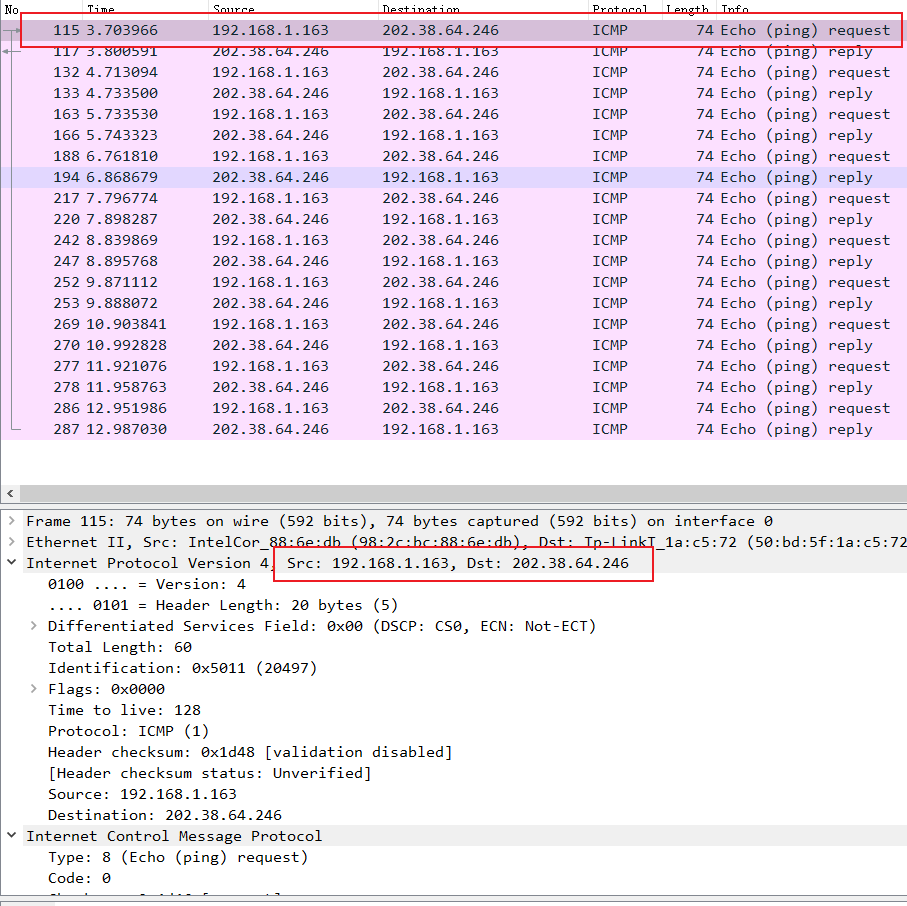
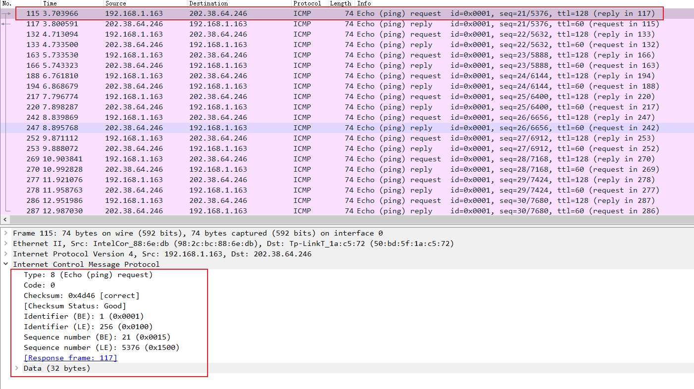
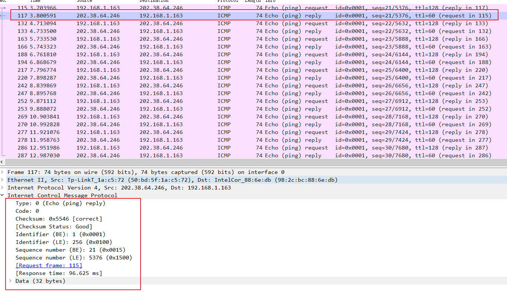
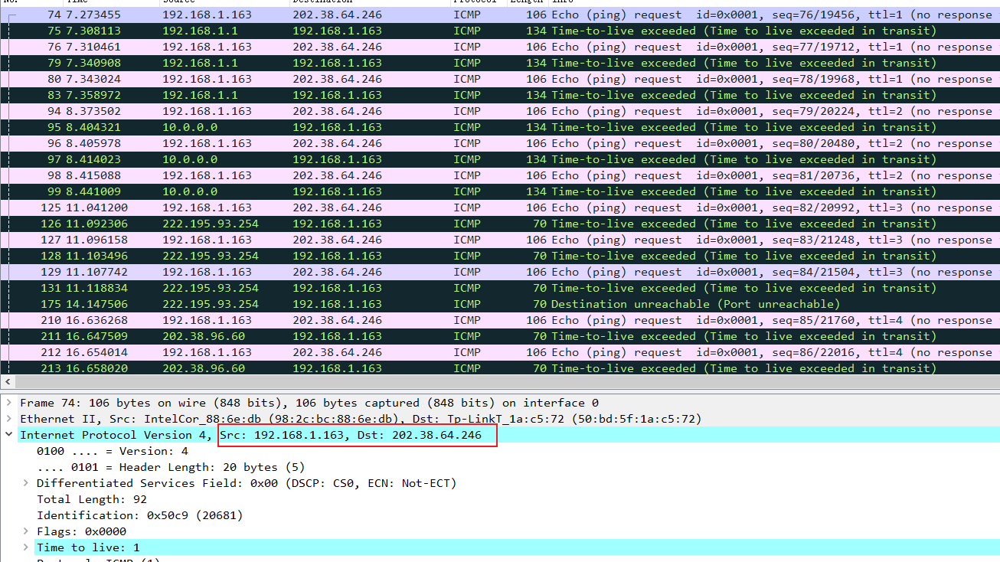
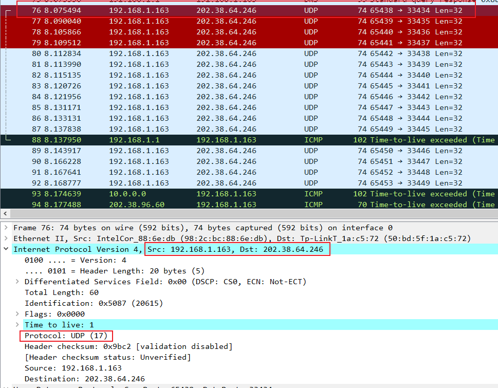
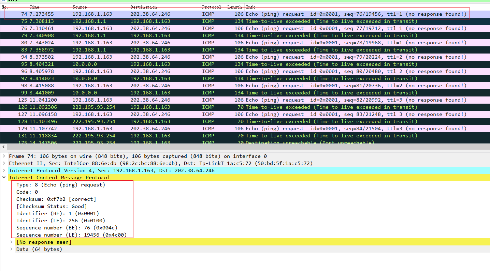
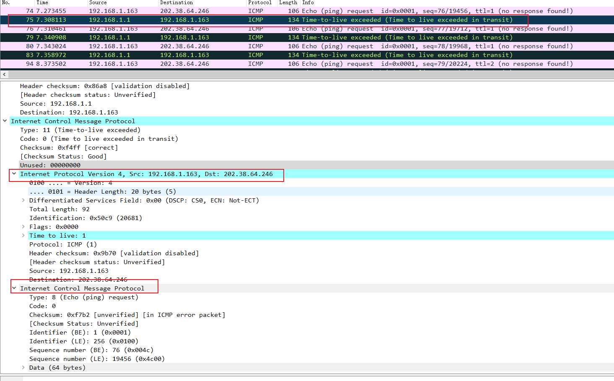
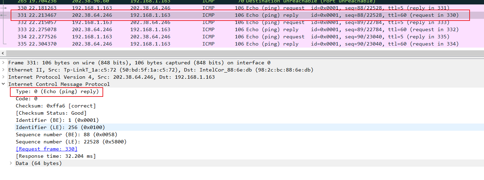
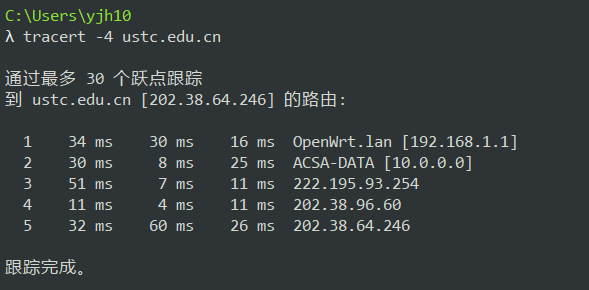
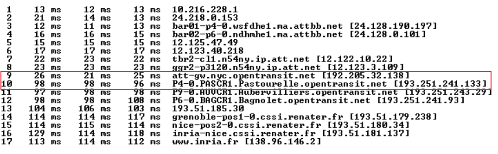

# Computer Networking Lab 7 -- ICMP

**Notice: 执行的命令为 `ping -n 10 ustc.edu.cn`**

## 1. What is the IP address of your host? What is the IP address of the destination host?

- My host IP: `192.168.1.163`
- Destination host IP: `202.38.64.246`

## 2. Why is it that an ICMP packet does not have source and destination port numbers?

因为 ICMP 被设计为用来在网络层中的主机或路由器之间交换信息，而不是在应用层的进程之间交换数据，所以无需使用 port number 来指定源与目的进程。

## 3. Examine one of the ping request packets sent by your host. What are the ICMP type and code numbers? What other fields does this ICMP packet have? How many bytes are the checksum, sequence number and identifier fields?

- `ICMP Type`: `8 (Echo (ping) request)`.
- `Code`: `0`

除此之外还有 `Checksum`、`Identifier (BE)`、`Identifier (LE)`、`Sequence number (BE)`、`Sequence number (LE)`、`Data`.

- `Checksum`、`Identifier` 和 `Sequence number` 的长度都是 2 bytes.

## 4. Examine the corresponding ping reply packet. What are the ICMP type and code numbers? What other fields does this ICMP packet have? How many bytes are the checksum, sequence number and identifier fields?

- `ICMP Type`: `0 Echo (ping) reply`
- `Code`: `0`

除此之外还有 `Checksum`、`Identifier (BE)`、`Identifier (LE)`、`Sequence number (BE)`、`Sequence number (LE)`、`Data`.

- `Checksum`、`Identifier` 和 `Sequence number` 的长度都是 2 bytes.

## 5. What is the IP address of your host? What is the IP address of the target destination host?

- My host IP address: `192.168.1.163`
- Description host IP address: `202.38.64.246`

## 6. If ICMP sent UDP packets instead (as in Unix/Linux), would the IP protocol number still be 01 for the probe packets? If not, what would it be?

**WSL 下执行 `traceroute -q 1 ustc.edu.cn` 抓的包如下：**

`Protocol` 不是 `(ICMP) 1`, 而是 `(UDP) 17`.

## 7. Examine the ICMP echo packet in your screenshot. Is this different from the ICMP ping query packets in the first half of this lab? If yes, how so?

ICMP echo packet 信息如下：

比较第 3 题图，两者拥有的 field 相同。

## 8. Examine the ICMP error packet in your screenshot. It has more fields than the ICMP echo packet. What is included in those fields?

多了上图中框出的 2 个 fields, 分别是此条报文对应的、本机发送的 echo packet 的 IP 数据包的 Header 和 ICMP 数据包内容。

## 9. Examine the last three ICMP packets received by the source host. How are these packets different from the ICMP error packets? Why are they different?

`ICMP Type` 字段不同，error packet 中此字段为 `11 (Time-to-live exceeded)`, 而后三个正常的报文中，此字段为 `0 (Echo (ping) reply)`.

## 10. Within the tracert measurements, is there a link whose delay is significantly longer than others? Refer to the screenshot in Figure 4, is there a link whose delay is significantly longer than others? On the basis of the router names, can you guess the location of the two routers on the end of this link?

`tracert` 的执行输出如下：

没有发现有两跳之间的链路耗时显著更长。

而问题给出的 Figure 4 中，第 9 和第 10 跳之间的链路耗时显著更长。

从名字可以猜测是从 New York 到 Pastourelle, France 的链路。
