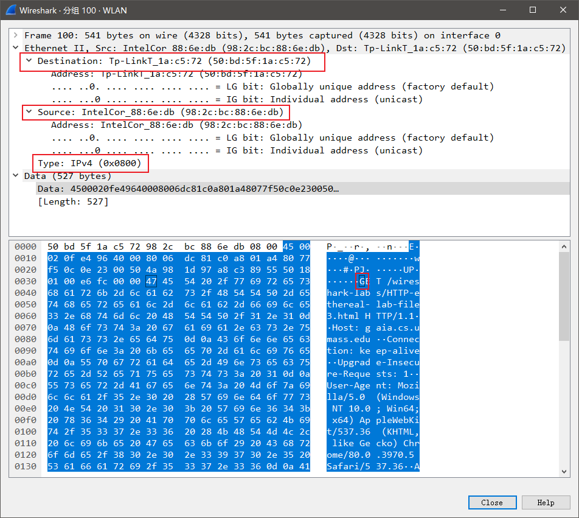
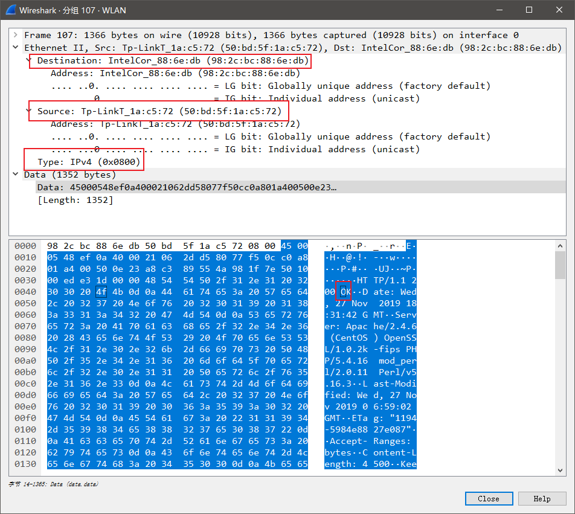
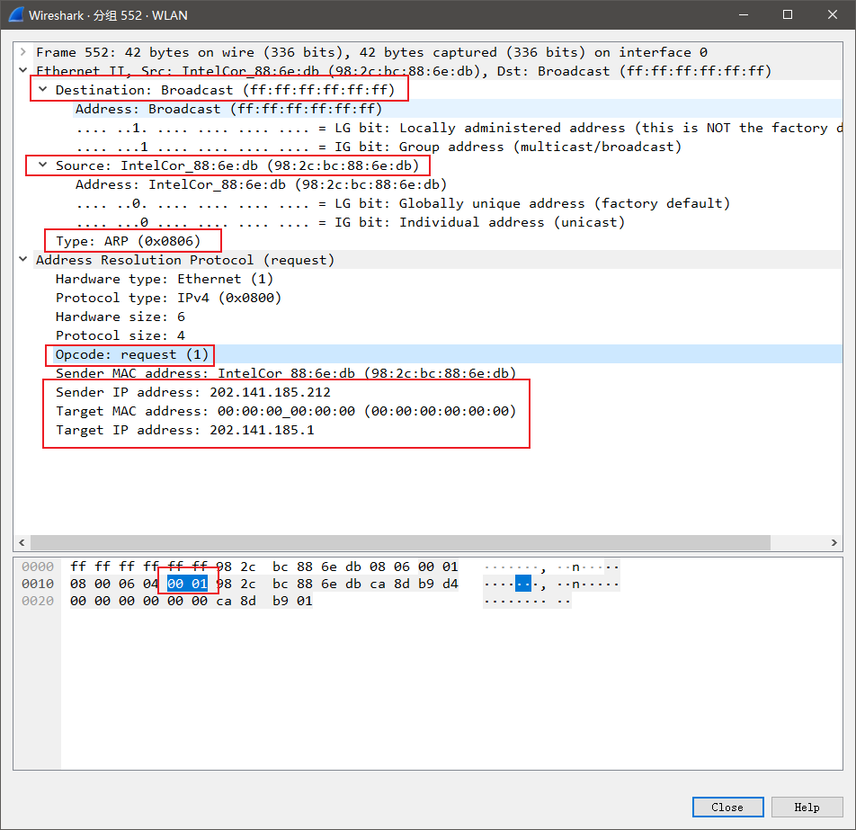
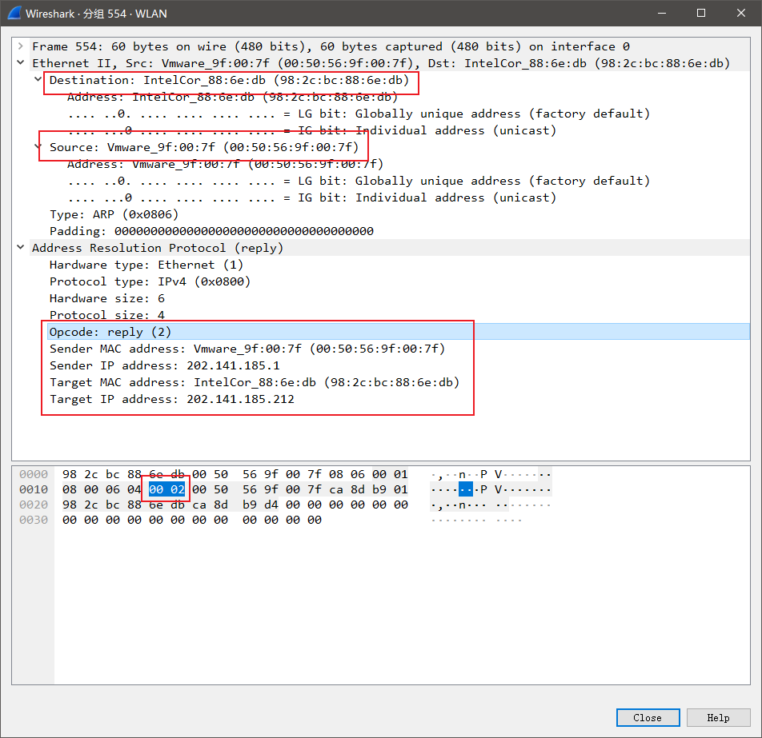
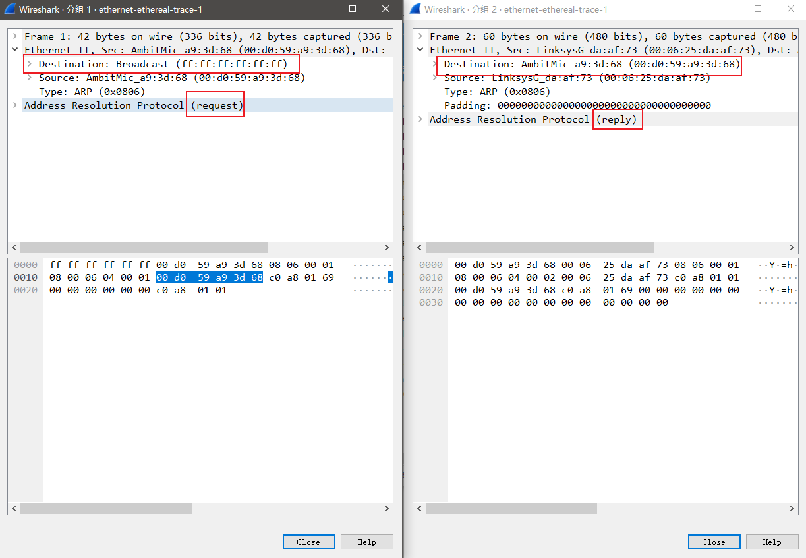

# Computer Networking Lab 9 -- Ethernet & ARP

## 1



本机的 Ethernet 地址为 `98:2c:bc:88:6e:db`.

## 2

由第 1 题图，目标 Ethernet 地址为 `50:bd:5f:1a:c5:72`.

这不是 `gaia.cs.umass.edu` 的 Ethernet 地址，是局域网网关的 Ethernet 地址。

## 3

由第 1 题图，`Type` 域的值为 `0x0800`, 代表上层协议为 IPv4.

## 4

由第 1 题图，共有 $16+16+16+7=55$ bytes.

## 5



Ethernet 源地址是 `50:bd:5f:1a:c5:72`.

既不是我的计算机 Ethernet 地址，也不是 `gaia.cs.umass.edu` 的 Ethernet 地址。

设个地址是局域网网关拥有的。

## 6

如第 5 题图，目的地址是 `98:2c:bc:88:6e:db`, 是我的计算机地址。

## 7

由第 5 题图，`Type` 域的值为 `0x0800`, 代表上层协议为 IPv4.

## 8

由第 5 题图，共有 $16+16+16+16+4=68$ bytes.

## 9

Windows 下执行 `arp -a` 结果如下：

```powershell
> arp -a

接口: 202.141.185.212 --- 0x5
  Internet 地址         物理地址              类型
  202.141.185.1         00-50-56-9f-00-7f     动态
  202.141.185.255       ff-ff-ff-ff-ff-ff     静态
  224.0.0.22            01-00-5e-00-00-16     静态
  224.0.0.251           01-00-5e-00-00-fb     静态
  224.0.0.252           01-00-5e-00-00-fc     静态
  239.255.255.250       01-00-5e-7f-ff-fa     静态
  255.255.255.255       ff-ff-ff-ff-ff-ff     静态
```

从左到右三列的含义分别是：**IP 地址**、**Ethernet 地址**、**类型**。

## 10



- 源地址：`98:2c:bc:88:6e:db`
- 目标地址：`ff:ff:ff:ff:ff:ff`

## 11

由第 10 题图，`Type` 域的值为 `0x0806`, 代表上层协议为 `ARP`.

## 12

### (a)

如第 10 题图，`opcode` 域从第 21 byte 开始。

### (b)

如第 10 题图，`opcode` 域的值为 `1`, 代表这是一个 `request` 报文。

### (c)

如第 10 题图，包含发送方地址，为 `Sender IP address` 域。

### (d)

如第 10 题图，`Target IP address` 域指明了要查询的 IP 地址为 `202.141.185.1`，是 ARP request 的「问题」。`Target MAC address` 指明对应的 Ethernet 地址为 `00:00:00:00:00:00`, 这是一个空地址，等待填入查询到的「答案」。

## 13



### (a)

如图，`opcode` 域从第 21 byte 开始。

### (b)

如图，`opcode` 域的值为 `2`, 代表这是一个 `reply` 报文。

### (c)

如图，`Sender MAC address` 域的值即是 ARP request「问题」的「答案」，此处的值为 `00:50:56:9f:00:7f`。 

## 14

如 13 题图：

- 源地址：`00:50:56:9f:00:7f`.
- 目标地址：`98:2c:bc:88:6e:db`.

## 15



如图，ARP request 是广播的，局域网中的每台机器都会收到消息，但 ARP reply 是单播的，只有发送 request 的电脑才能收到 reply.

## EX-1

需要分两类情况讨论。

> 本机 IP 为 `192.168.43.160`, 子网掩码为 `255.255.255.0`.

- 若所设置的 IP 与本机 IP 不在同一子网中，则仍然正常访问：

  ```powershell
  > arp -s 114.114.114.114 00-11-22-33-44-55  # 把不同子网下的 114.114.114.114 映射到错误的 MAC
  
  > arp -a

  接口: 192.168.43.160 --- 0x5
    Internet 地址         物理地址              类型
    114.114.114.114       00-11-22-33-44-55     静态  # 错误项
    192.168.43.1          ec-d0-9f-5b-da-19     动态
    224.0.0.22            01-00-5e-00-00-16     静态
  
  > ping 114.114.114.114

  正在 Ping 114.114.114.114 具有 32 字节的数据:
  来自 114.114.114.114 的回复: 字节=32 时间=33ms TTL=248
  来自 114.114.114.114 的回复: 字节=32 时间=74ms TTL=248
  来自 114.114.114.114 的回复: 字节=32 时间=55ms TTL=248
  来自 114.114.114.114 的回复: 字节=32 时间=46ms TTL=248

  114.114.114.114 的 Ping 统计信息:
      数据包: 已发送 = 4，已接收 = 4，丢失 = 0 (0% 丢失)，
  往返行程的估计时间(以毫秒为单位):
      最短 = 33ms，最长 = 74ms，平均 = 52ms
  ```

- 若所设置的 IP 与本机 IP 在同一子网中，则访问失败：

  ```powershell
  >  netsh -c "i i" add neighbors 5 192.168.43.87 00-11-22-33-44-55  # 把同一子网下的 192.168.43.87 映射到错误的 MAC

  >  arp -a

  接口: 192.168.43.160 --- 0x5
    Internet 地址         物理地址              类型
    192.168.43.1          ec-d0-9f-5b-da-19     动态
    192.168.43.87         00-11-22-33-44-55     静态  # 错误项
    192.168.43.255        ff-ff-ff-ff-ff-ff     静态
    224.0.0.22            01-00-5e-00-00-16     静态
    224.0.0.251           01-00-5e-00-00-fb     静态
    224.0.0.252           01-00-5e-00-00-fc     静态
    239.255.255.250       01-00-5e-7f-ff-fa     静态
  
  > ping 192.168.43.87

  正在 Ping 192.168.43.87 具有 32 字节的数据:
  请求超时。
  请求超时。
  请求超时。
  请求超时。

  192.168.43.87 的 Ping 统计信息:
      数据包: 已发送 = 4，已接收 = 0，丢失 = 4 (100% 丢失)，
  ```

## EX-2

在 PowerShell 中执行命令：

```powershell
> netsh interface ipv4 show interfaces 5

接口 WLAN 参数
----------------------------------------------
IfLuid                             : wireless_32768
IfIndex                            : 5
状态                              : connected
跃点数                             : 35
链接 MTU                           : 1500 字节
可访问时间                     : 16500 毫秒
基本可访问时间                : 30000 毫秒
重传间隔            : 1000 毫秒
DAD 传输                      : 3
站点前缀长度                 : 64
站点 ID                            : 1
转发                         : disabled
播发                        : disabled
邻居发现                 : enabled
邻居无法访问检测  : enabled
路由器发现                   : dhcp
受管理的地址配置      : enabled
其他有状态的配置       : enabled
弱主机发送                    : disabled
弱主机接收                 : disabled
使用自动跃点数               : enabled
忽略默认路由              : disabled
播发的路由器生存期         : 1800 秒
播发默认路由            : disabled
当前跃点限制                  : 0
强制 ARPND 唤醒模式       : disabled
定向 MAC 唤醒模式      : disabled
ECN 功能                     : application
基于 RA 的 DNS 配置(RFC 6106)     : disabled
DHCP/静态 IP 共存         : disabled
```

其中的「可访问时间」(`Reachable Time`) 即为一条 ARP 缓存项的有效时间，值为 `16500 ms`.

此时间是由「基本可访问时间」(`BaseReachable Time`) 计算而得的，算法如下：

$${\rm ReachableTime} = {\rm BaseReachable Time} \times {\rm RamdomValueBetween}({\rm MIN\_RANDOM\_FACTOR}, {\rm MAX\_RANDOM\_FACTOR})$$

Windows 中 `BaseReachable Time` 默认设为 `30000 ms`.

[**RFC 2461**](https://www.ietf.org/rfc/rfc2461.txt) 中对两个因子的值规定如下：

| Name              | Value |
| ----------------- | ----- |
| MIN_RANDOM_FACTOR | 0.5   |
| MAX_RANDOM_FACTOR | 1.5   |
